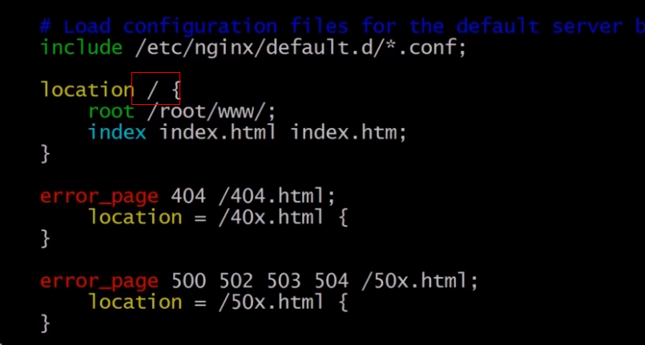

## ngnix安装与代码发布

ngnix在linux上的安装步骤和代码上传部署

## web服务器简介
一、nginx：高性能、高并发 
二、apache：多平台、安全、流星 
三、tomcat： 多用于java做jsp解析 

## 一、安装ngnix
系统：centos7
yum install ngnix(如果不能安装，先运行 yum install epel-release)

## 二、配置ngnix

1、找到ngnix配置文件，默认在/etc/ngnix/ngnix.conf。可以使用ngnix -t命令查找 
2、修改配置文件,user nginx 改为 user root 
3、更改根目录

## 三、上传代码到服务器
1、连接远程服务器 
本地输入ssh  用户名@ip地址 -p 端口号    例如：ssh root@47.97.105.144 -p22 

2、使用scp（如果没有scp，安装yum install openssh-client）
本地输入scp  -r 文件夹目录 root@ip地址:存放地址 例如: scp -r ./* root@47.97.105.144:/root/www

3、重启ngnix 远程操作
 3.1 停止ngnix，输入 nginx -s stop
 3.2 启动ngnix，输入nginx
 3.3 重启ngnix ，输入ngnix -s reload
 
 注：查看ngnix进程 ps -ef | grep nginx