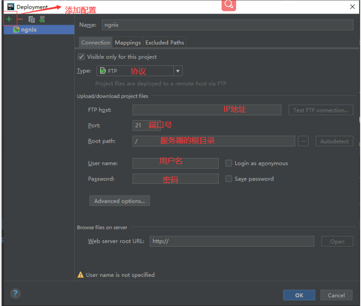
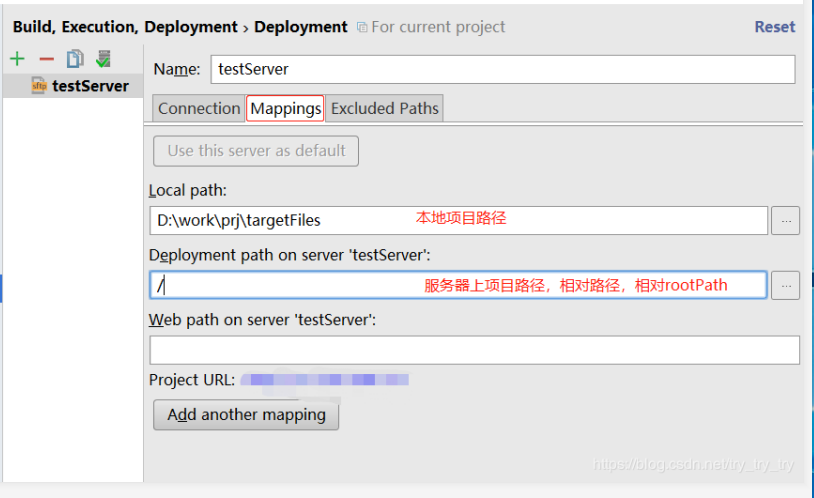
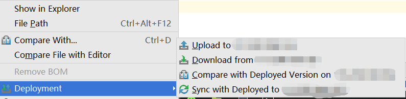

# webstorm自动部署到远程服务器

## 一、介绍
我们平时在工作中，总会遇到把代码打包后发布到服务器的场景。我之前总是习惯性用命令行把代码部署上去，这样的方式非常显得非常繁琐。幸运的是，webstorm本身自带智能强悍的功能
## 二、配置
1、Tools -> Deployment -> Configuration,点击左上角+号，填写名字（名字随意）

2、点击mapping

3、配置完后，确认

### 三、部署
1、 右键打包的文件夹，如dist文件夹， Deployment -> Upload to 服务器地址

###四、总结
虽然只是简单的配置下服务器的配置，但在我们工作中提供了巨大的便利。大大提高了工作效率
